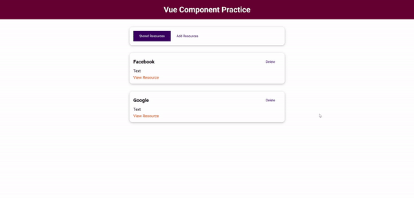

# vue-component-practice

Second mini project from the Udemy course "Vue - The Complete Guide (w/ Router, Vuex, Composition API)"

## Preview




## Project setup
```
yarn install
```

### Compiles and hot-reloads for development
```
yarn serve
```

### Compiles and minifies for production
```
yarn build
```

### Lints and fixes files
```
yarn lint
```

### Customize configuration
See [Configuration Reference](https://cli.vuejs.org/config/).
